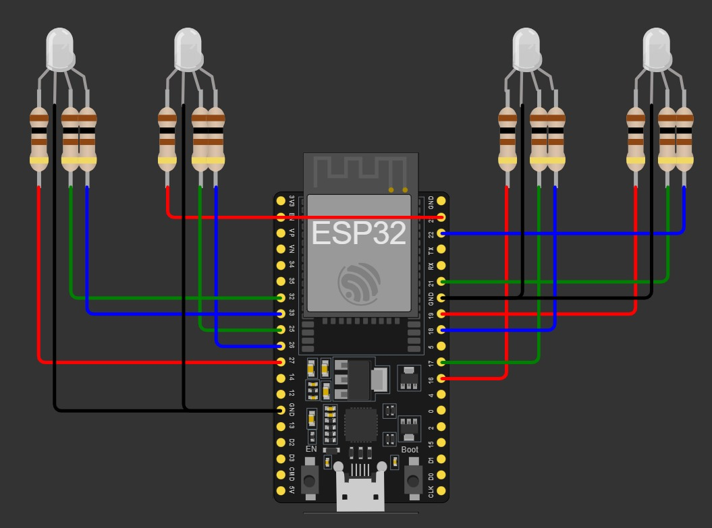
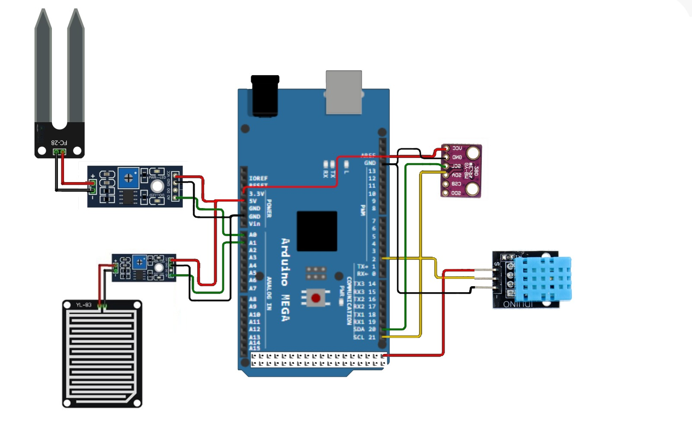
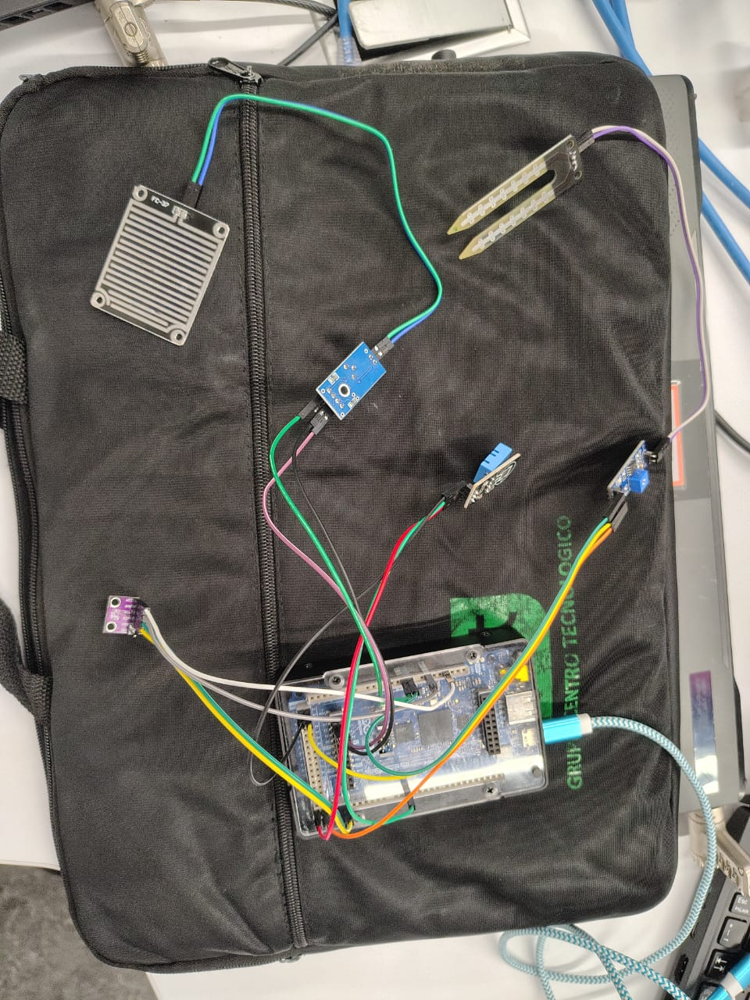
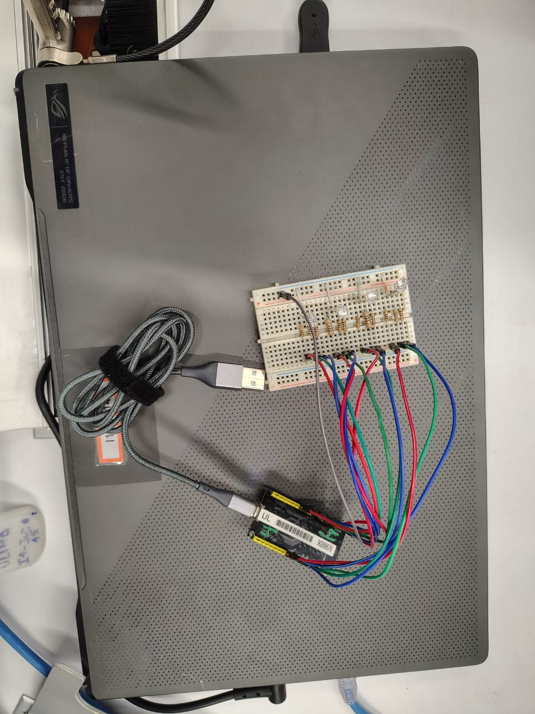

# Online Weather Station

Este proyecto es el trabajo final del curso de **Internet de las Cosas**. Su propósito es implementar una estación meteorológica en línea que permita la comunicación entre dispositivos, utilizando las capacidades del **Arduino GIGA R1** y el **ESP32**. Además, se busca integrar sensores para la captura de datos ambientales y proporcionar una interfaz web en tiempo real.

---

## Diseño del Proyecto

### Diagrama de Conexión

El diseño del proyecto se centra en la integración de múltiples dispositivos y sensores. Para ello, se desarrollaron los siguientes diagramas de conexión:

1. **Figura 1**: Conexión de la placa ESP32 con los LEDs RGB. Esta placa actúa como el servidor principal que controla las notificaciones visuales y gestiona la interfaz web.

2. **Figura 2**: Conexión del Arduino GIGA R1 (representado por el MEGA 2560 en el gráfico). Esta placa captura datos de los sensores ambientales:

   - **Sensores FC-28 y FC-37**: Miden la humedad del suelo, conectados a los pines A0 y A1 respectivamente.
   - **Sensor BMP280**: Monitorea presión y temperatura mediante comunicación I2C, utilizando los pines 20 (SDA) y 21 (SCL).
   - **Sensor DHT11**: Proporciona datos de temperatura y humedad ambiental, conectado al pin digital 2.

Estos sensores permiten recolectar información clave del entorno para su procesamiento y análisis.

---

### Funcionamiento del Proyecto

El funcionamiento del sistema se puede dividir en dos partes principales: la recolección de datos por parte del Arduino GIGA R1 y su gestión y visualización a través del ESP32.

1. **Arduino GIGA R1**:
   - Se conecta a la red Wi-Fi configurada en el código.
   - Utiliza una función para capturar datos de los sensores conectados y almacena los valores en variables globales.
   - Los datos son enviados al ESP32 mediante el protocolo HTTP, utilizando el método POST. Antes del envío, se preparan en un formato JSON para garantizar la compatibilidad con el servidor receptor.
   - La conexión HTTP se gestiona de manera que cada envío espere una respuesta del servidor para confirmar la recepción de los datos.

2. **ESP32**:
   - Configura sus pines para controlar los LEDs RGB, los cuales se utilizan como indicadores visuales de los niveles registrados por los sensores (por ejemplo, rojo para valores críticos).
   - Se conecta a la misma red Wi-Fi y actúa como servidor, gestionando las solicitudes entrantes a través de WebSocket.
   - Sirve una interfaz web interactiva, que incluye una estructura HTML y scripts JavaScript para actualizar los datos en tiempo real.
   - Recibe datos del Arduino GIGA R1 mediante consultas POST, procesa esta información y actualiza las variables globales que se reflejan en la interfaz web y los LEDs RGB.

3. **Acceso a Internet**:
   - Para permitir el acceso remoto al sistema, se utiliza **Ngrok**, que crea un túnel seguro para exponer el servidor local del ESP32 a internet.
   - La configuración de Ngrok se realiza desde una computadora conectada a la misma red.

---

## Procedimientos, Incidencias y Resultados

### 1. Lectura de Sensores

#### Sensores FC-28 y FC-37
- **Función**: Miden la humedad del suelo.
- **Incidencias**:
  - Lecturas inesperadas cuando no hay agua cerca (valores menores a 1023).
  - Posible sobrecalentamiento del módulo FC-28, afectando su precisión.
- **Solución**: Manejar cuidadosamente el sensor para evitar daños.

#### Sensor DHT11
- **Función**: Mide temperatura y humedad ambiental.
- **Incidencias**:
  - Error al compilar el código por una versión desactualizada de la librería.
  - Fallos en la transmisión de corriente cuando se utilizó un protoboard.
- **Solución**:
  - Actualizar la librería.
  - Conectar directamente el sensor al Arduino, evitando el uso del protoboard.

#### Sensor BMP280
- **Función**: Monitorea presión y temperatura.
- **Incidencias**: Problemas iniciales de lectura.
- **Solución**: Usar la librería oficial del sensor y probar su funcionalidad con códigos de ejemplo.

### 2. Configuración de Wi-Fi

#### Arduino GIGA R1
- **Puntos clave**:
  - Configurar el nombre de las variables en el código y la dirección IP del ESP32.
  - Establecer un intervalo de envío de datos de 4 segundos para evitar conflictos.

#### ESP32
- **Estrategia**:
  - Agregar funcionalidades de forma gradual, realizando pruebas con cada cambio.
  - Mantener copias de seguridad del código tras cada modificación exitosa.

### 3. LEDs RGB

Aunque su implementación parece sencilla, surgieron varios desafíos:

- **Uso excesivo de pines**: Se necesitaron hasta 12 pines, lo cual complicó la gestión del cableado.
- **Pruebas con transistores**: Intentos de bloquear la conexión a tierra no dieron resultados satisfactorios.
- **Propuesta alternativa**: Crear un módulo I2C para controlar múltiples LEDs RGB con solo 4 cables (2 para comunicación y 2 para energía).
- **Organización de cables**: Etiquetar los cables según su color y cortar las patas sobrantes de las resistencias para evitar cortocircuitos.

### 4. Salida a Internet

Inicialmente, se consideró **Cloudflare** para exponer el servidor, pero surgieron problemas al integrar WebSocket. Finalmente, se optó por **Ngrok**, que resultó ser más práctico para las exposiciones.

- **Ngrok en laptop**: La solución más eficiente dada la disponibilidad de equipos en el laboratorio.
- **Alternativas descartadas**:
  - Uso de **Termux** en celulares del laboratorio, ya que requería servicios adicionales.

---

## Repositorio de Código

Los avances del proyecto están disponibles en las siguientes carpetas:

- **[Código Inicial](development_code)**: Contiene los primeros desarrollos del sistema.
- **[Código Final](production_code)**: Incluye la versión funcional del proyecto.

---

## Créditos

Desarrollado por estudiantes del curso de **Internet de las Cosas**:.
- Angeles Nicole Castillo Peña
- Jorge Alexander Costilla Garro
- Sebastian Armando Palomino Pagador
- Cliff Arthur Vicuña Guerrero
